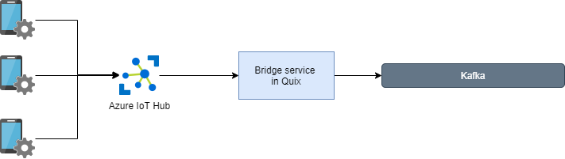
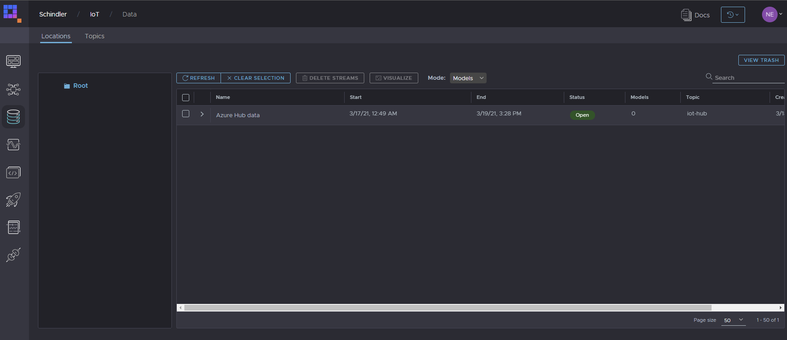
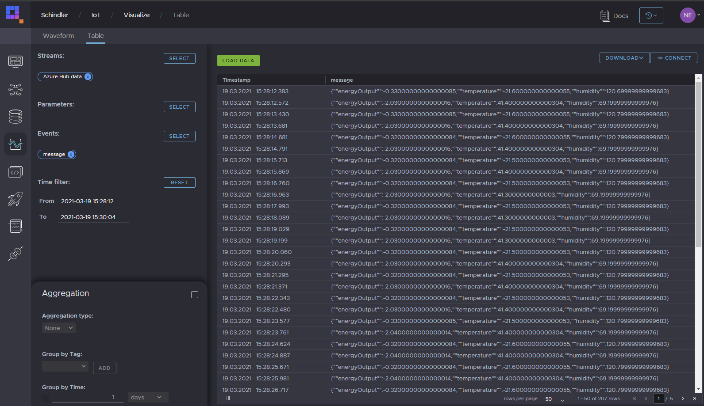

# Microsoft Azure IoT Hub bridge
The sample contained in this folder gives an example on how to connect to Azure IoT hub and bridge data into Kafka using Quix SDK.

[](doc/iot-bridge.png "Architecture") 

## Requirements to run the sample
- .Net Core 3.0 SDK https://dotnet.microsoft.com/download/dotnet-core/3.0

## Run the sample
- In root folder run `dotnet restore`
- `cd .\IoT.Brige\`
- `dotnet run`


## Code walkthrough
In this code snippet, service connects to Kafka topic in Quix.
### Connection to Quix
```csharp
 // Create a client factory. Factory helps you create StreamingClient (see below) a little bit easier
var client = new Quix.Sdk.Streaming.StreamingClient(
    "{placeholder:broker.address}",
    new SecurityOptions(
        "{placeholder:broker.security.certificatepath}",
        "{placeholder:broker.security.username}",
        "{placeholder:broker.security.password}"));


// Create a StreamingClient (using the factory) in order to easily create new streams for the above configured topic
using var outputTopic = client.OpenOutputTopic("{placeholder:outputTopic}");
```

### Connection to IoT Hub
Use **az** to get connection information for specified IoT hub.

```csharp
// Event Hub-compatible endpoint
// az iot hub show --query properties.eventHubEndpoints.events.endpoint --name {your IoT Hub name}
var eventHubsCompatibleEndpoint = "{placeholder:endpoint}";

// Event Hub-compatible name
// az iot hub show --query properties.eventHubEndpoints.events.path --name {your IoT Hub name}
var eventHubName = "{placeholder:eventHubName}";

// az iot hub policy show --name service --query primaryKey --hub-name {your IoT Hub name}
var iotHubSasKeyName = "{placeholder:service}";
var iotHubSasKey = "{placeholder:SAS_KEY}";

// If you chose to copy the "Event Hub-compatible endpoint" from the "Built-in endpoints" section
// of your IoT Hub instance in the Azure portal, you can set the connection string to that value
// directly and remove the call to "BuildEventHubsConnectionString".
string connectionString =
    BuildEventHubsConnectionString(eventHubsCompatibleEndpoint, iotHubSasKeyName, iotHubSasKey);

// Create the consumer using the default consumer group using a direct connection to the service.
// Information on using the client with a proxy can be found in the README for this quick start, here:
//   https://github.com/Azure-Samples/azure-iot-samples-csharp/tree/master/iot-hub/Quickstarts/read-d2c-messages/README.md#websocket-and-proxy-support
//
await using EventHubConsumerClient consumer =
    new EventHubConsumerClient(EventHubConsumerClient.DefaultConsumerGroupName, connectionString,
        eventHubName);
```

## Deployment
This bridge can run locally or in our serverless environment. To learn how to deploy services in Quix please see our [doc](https://documentation.platform.quix.ai/deploy/).

## Result
**If persistence on your topic is enabled**, stream with data from IoT Hub willl be persisted to the catalogue where you can query it. 

[](img/azure-hub-data.png "Stream in data catalogue")


[](img/events-table.png "Model parameters in parameter browser")
